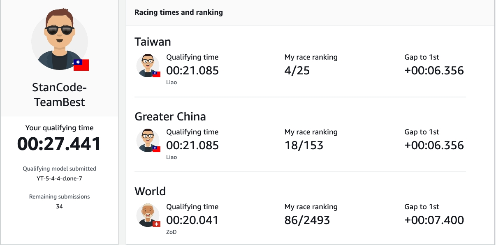
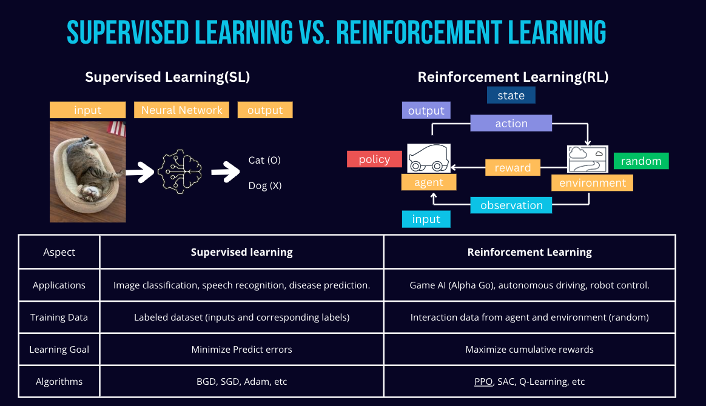
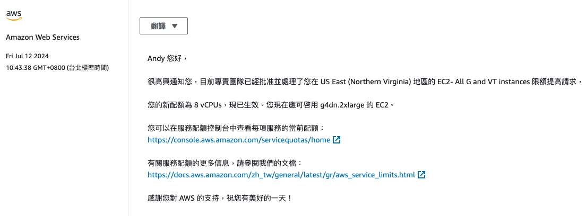
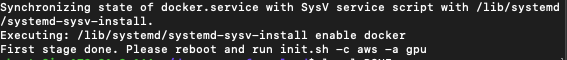
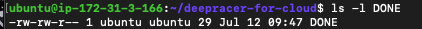

# AWS DeepRacer stanCode 201 Mar2024 B組 July 參賽紀錄

這個repo紀錄stanCode201 Mar2024 AI班 B組參與DeepRacer 7月份的過程，我會詳細記錄如何一步一步執行DeepRacer Community提供的deepracer-for-cloud(DRfC)的訓練，以及說明我們小組的策略。

README會包含以下內容：
1. 參賽結果
2. AWS DeepRacer介紹
3. 如何進行DRfC的訓練
4. 總花費
5. Reward function
6. Action Space
7. Hyperparameters
8. Log Anlysis

## 1.參賽結果

感謝同組夥伴Blair, 孟勳, 宇韜, 沛融還有mentor南哥，最重要的是全額贊助我們的stanCode創辦人Jerry，讓我們可以不用擔心AWS貴鬆鬆的花費盡情的訓練！
我們組別在七月份的競賽結果為全台第四名，以及全球前一百名！！！

## 2.AWS DeepRacer介紹
關於DeepRacer是什麼，以及競賽規則說明可以參考[官方網站的說明](https://docs.aws.amazon.com/zh_tw/deepracer/latest/developerguide/what-is-deepracer.html)。
在此會著重在DeepRacer Community中常常提到的專有名詞以及其應用的RL原理進行說明：


SL跟RL這兩種訓練方式的訓練資料很不一樣，監督式學習的資料有固定的答案，所以我們的目標就是盡量減少判斷的錯誤，因此我們會用Gradient Decent的方式讓誤差隨著訓練而下降。
但RL的學習資料則是有隨機性，例如在DeepRacer競賽中，車子現在行進到某個位置，你此時的state，也就是在彎中的角度、距離賽道的邊界也都會不一樣。
因此，在上面的RL示意圖中，agent，也就是車子，必須透過跟賽道environment的互動，利用action來確認現在是不是恰當的動作，藉此得到reward。
那什麼是恰當的動作？這個部分我們可以透過設定reward function來引導，例如我們會懲罰超出賽道、獎勵彎道中保持方向盤角度，或是保持越快的速度有越高的reward。
而車子每完成一次action後就會改變環境，作為新的input提供給agent。
透過這樣的訓練過程，我們會得到車子的policy，也可以想像成是開車的風格，風格可以決定我們面對當下環境要做什麼action，看是要激進過彎還是保守過彎。
最終我們透過計算Reward的總和來評價模型表現的好壞。
但要用什麼演算法達到RL的最佳模型？在DeepRacer中，絕大多數的人都會選擇PPO（Proximal Policy Optimization）演算法，他可以透過限制每次更新的幅度，來保持訓練過程的穩定性和效率。

AWS在這個競賽中提供兩種常見的演算法：PPO 和 SAC，主要有三個不同點
* Action Space兼容性：PPO 適用於離散和連續action space，而 SAC 主要適用於連續型。
* 學習方法：PPO 是 on-policy 算法，即從當前策略的觀察中學習，也因此實時數據需求非常大；SAC 是 off-policy 算法，可以利用先前策略的觀察進行學習。
* Entropy的處理：PPO 使用Entropy regularization來鼓勵探索，防止過早收斂，喪失探索性；SAC 通過在最大化目標中添加Entropy來平衡探索與過早收斂。

我們在DeepRacer的社群中發現大多數人都會選擇PPO，也是我們主要選擇的算法，我們歸納出以下幾個原因：
* PPO在policy上可以避免用過時或不相關的數據，因此可以保持連貫性跟穩定性。
* 數據跟策略的更新是同步的，所以可以減少數據分佈變化引起的不確定性。
* 第三，PPO會限制每次policy的更新都是小幅度的，因此可以確保模型的更新較為平穩。
* 最後PPO會根據當前最準確且最相關的數據來進行更新，可以確保學習的效率。

## 3.如何進行DRfC的訓練
以下以我們組使用AWS的雲端服務的操作步驟進行說明，主要參考來源為DRfC的[官方文件](https://aws-deepracer-community.github.io/deepracer-for-cloud/)、[CSDN部落格](https://blog.csdn.net/awschina/article/details/125299659?spm=1001.2101.3001.6650.2&utm_medium=distribute.pc_relevant.none-task-blog-2%7Edefault%7EBlogCommendFromBaidu%7ERate-2-125299659-blog-124744429.235%5Ev43%5Epc_blog_bottom_relevance_base2&depth_1-utm_source=distribute.pc_relevant.none-task-blog-2%7Edefault%7EBlogCommendFromBaidu%7ERate-2-125299659-blog-124744429.235%5Ev43%5Epc_blog_bottom_relevance_base2&utm_relevant_index=5)以及這個中國小哥的[影片](https://www.youtube.com/watch?v=ADbhcXwQzDY&t=60s)

具體的操作步驟可依照CSDN部落格裡面的步驟進行，但我會針對一些步驟進行補充說明以及提供我在操作時遇到的一些問題進行解答。

### (1)Deep learning AMI選擇
在CSDN部落格跟中國小哥的影片中都使用Ubuntu 18.04，不過這是2022年的資料，現在如果在AWS申請的話會找不到18.04的版本，本次使用的是Ubuntu 20.04。

### (2)EC2 instance選擇
社群中推薦的EC2 instance為g4dn.2xlarge，為CP值較高的選擇，我們這次的訓練也是以此規格進行訓練。一些國外的玩家會使用請求spot的方式動態調用空閒的instance，這樣可以減少70%以上的費用，但如果台灣地區要使用DeepRacer的話，一般來說地區選擇都需選擇US-EAST-1才能參與競賽，而偏偏US-EAST-1幾乎不會有空閒的instance可以調用，即使可以調用，也可能會訓練到一半就停止。所以還是需要考慮使用On-Demand的方式申請g4dn.2xlarge。若要申請g4dn.2xlarge，需到支援中心。

### (3)在終端機連線到已建立好的EC2 instance
請確保已先申請EC2的金鑰(.pem)(切記不能弄丟)並儲存在電腦，以下以Mac的操作為例進行說明
a. 開啟終端機
b. 輸入連線金鑰
```
chmod 400 sc201.pem
ssh -i sc201.pem ubuntu@44.197.185.38 # IP位置請更換為您所申請的EC2 instance的IPv4 public IP
```
c. 下載DeepRacer for Cloud的package
```
git clone https://github.com/aws-deepracer-community/deepracer-for-cloud.git
```
d. 設置環境
```
cd deepracer-for-cloud && ./bin/prepare.sh
```
初次設定可能會遇到諸多問題，以下提供目前遇到的問題以及解法
* 問題一
  ```
  The following packages have unmet dependencies:
  docker.io : Depends: containerd (>= 1.2.6-0ubuntu1~)
  E: Unable to correct problems, you have held broken packages.
  ```
  解法：[參考網站](https://blog.csdn.net/p1279030826/article/details/126185482)
* 問題二
  ```
  dpkg-deb: error: paste subprocess was killed by signal (Broken pipe)
  Selecting previously unselected package docker-compose-v2.
  Preparing to unpack .../docker-compose-v2_2.24.6+ds1-0ubuntu1~20.04.1_amd64.deb ...
  Unpacking docker-compose-v2 (2.24.6+ds1-0ubuntu1~20.04.1) ...
  dpkg: error processing archive /var/cache/apt/archives/docker-compose-v2_2.24.6+ds1-0ubuntu1~20.04.1_amd64.deb (--unpack):
   trying to overwrite '/usr/libexec/docker/cli-plugins/docker-compose', which is also in package docker-compose-plugin 2.28.1-1~ubuntu.20.04~focal
  dpkg-deb: error: paste subprocess was killed by signal (Broken pipe)
  Errors were encountered while processing:
   /var/cache/apt/archives/docker-buildx_0.12.1-0ubuntu1~20.04.2_amd64.deb
   /var/cache/apt/archives/docker-compose-v2_2.24.6+ds1-0ubuntu1~20.04.1_amd64.deb
  E: Sub-process /usr/bin/dpkg returned an error code (1)
  ```
  解法：
  步驟一： 卸載衝突的package
  ```
  sudo apt-get remove -y docker-compose-v2 docker-compose-plugin docker-buildx
  ```
  步驟二：清理package的緩存
  ```
  sudo apt-get clean
  sudo apt-get autoremove -y
  ```
  步驟三：更新package列表
  ```
  sudo apt-get update
  ```
  步驟四：手動安裝最新的Docker Compose
  ```
  sudo curl -L "https://github.com/docker/compose/releases/download/v2.24.0/docker-compose-$(uname -s)-$(uname -m)" -o /usr/local/bin/docker-compose
  sudo chmod +x /usr/local/bin/docker-compose
  ```
  步驟五：繼續執行DeepRacer
  ```
  cd deepracer-for-cloud
  ./bin/prepare.sh
  ```
  完成第一階段的安裝後會看到此

接著進行重啟+初始化
e. 重啟instance
```
sudo reboot
```
f. 重新連線到EC2 instance
```
chmod 400 sc201.pem
ssh -i sc201.pem ubuntu@44.197.185.38
```
g. 執行初始化腳本
```
cd deepracer-for-cloud
./bin/init.sh -c aws -a gpu
```
該腳本會繼續設置完整的倉儲，並下載核心的Docker Image，完成之後系統會建立一個名為DONE的文件
```
ls -l DONE
```

接著就可以開始進行雲端訓練了～

### (4)在DRfC進行多人訓練
在DRfC提供的套件中，可以執行多個訓練，需注意的是申請的instance的容量以及速度會影響到可訓練的資源分配，舉例來說g4dn.2xlarge我們嘗試最多可以進行三組訓練，如有需要進行更多人同時訓練，可能要考慮申請更大的instance資源(請衡量預算，AWS的instance使用並不便宜...後續會在花費中說明)

  
## 4.總花費
## 5.Reward function
## 6.Action Space
## 7.Hyperparameters
## 8.Log Anlysis
