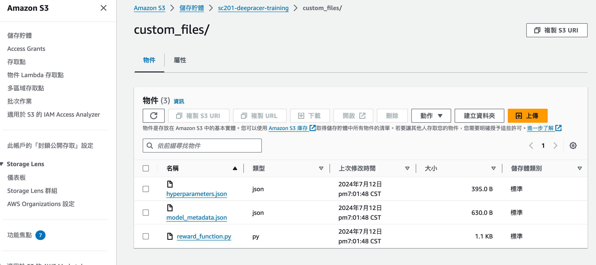
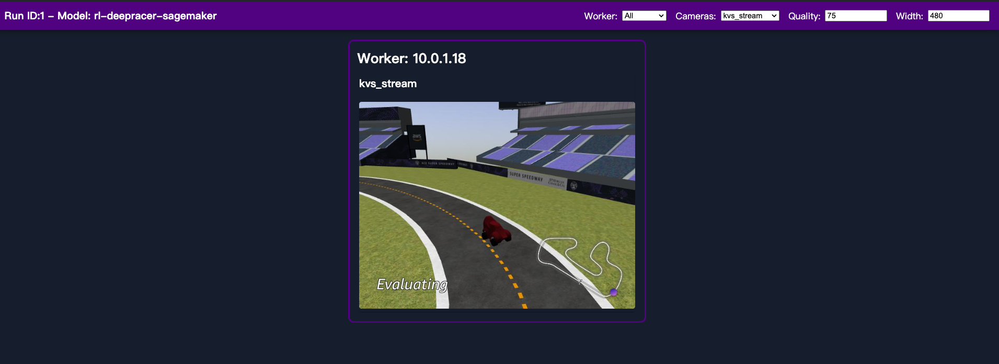

# AWS DeepRacer stanCode 201 Mar2024 B組 July 參賽紀錄

這個repo紀錄stanCode201 Mar2024 AI班 B組參與DeepRacer 7月份的過程，我會詳細記錄如何一步一步執行DeepRacer Community提供的deepracer-for-cloud(DRfC)的訓練，以及說明我們小組的策略。

README會包含以下內容：
[1. 參賽結果](https://github.com/andy84858/Amazon-DeepRacer-Jul2024?tab=readme-ov-file#1%E5%8F%83%E8%B3%BD%E7%B5%90%E6%9E%9C)
[2. AWS DeepRacer介紹](https://github.com/andy84858/Amazon-DeepRacer-Jul2024?tab=readme-ov-file#2aws-deepracer%E4%BB%8B%E7%B4%B9)
[3. 如何進行DRfC的訓練](https://github.com/andy84858/Amazon-DeepRacer-Jul2024?tab=readme-ov-file#3%E5%A6%82%E4%BD%95%E9%80%B2%E8%A1%8Cdrfc%E7%9A%84%E8%A8%93%E7%B7%B4)
[4. 總花費](https://github.com/andy84858/Amazon-DeepRacer-Jul2024?tab=readme-ov-file#4%E7%B8%BD%E8%8A%B1%E8%B2%BB)
[5. Reward function](https://github.com/andy84858/Amazon-DeepRacer-Jul2024?tab=readme-ov-file#5reward-function)
[6. Action Space](https://github.com/andy84858/Amazon-DeepRacer-Jul2024?tab=readme-ov-file#6action-space)
[7. Hyperparameters](https://github.com/andy84858/Amazon-DeepRacer-Jul2024?tab=readme-ov-file#7hyperparameters)
[8. Log Anlysis](https://github.com/andy84858/Amazon-DeepRacer-Jul2024?tab=readme-ov-file#8log-anlysis)

## 1.參賽結果


感謝同組夥伴Blair, 孟勳, 宇韜, 沛融還有mentor南哥，最重要的是全額贊助我們的stanCode創辦人Jerry，讓我們可以不用擔心AWS貴鬆鬆的花費盡情的訓練！

我們組別在七月份的競賽結果為全台第四名，以及全球前一百名！！！

## 2.AWS DeepRacer介紹
關於DeepRacer是什麼，以及競賽規則說明可以參考[官方網站的說明](https://docs.aws.amazon.com/zh_tw/deepracer/latest/developerguide/what-is-deepracer.html)。

在此會著重在DeepRacer Community中常常提到的專有名詞以及其應用的RL原理進行說明：


SL跟RL這兩種訓練方式的訓練資料很不一樣，監督式學習的資料有固定的答案，所以我們的目標就是盡量減少判斷的錯誤，因此我們會用Gradient Decent的方式讓誤差隨著訓練而下降。
但RL的學習資料則是有隨機性，例如在DeepRacer競賽中，車子現在行進到某個位置，你此時的state，也就是在彎中的角度、距離賽道的邊界也都會不一樣。
因此，在上面的RL示意圖中，agent，也就是車子，必須透過跟賽道environment的互動，利用action來確認現在是不是恰當的動作，藉此得到reward。
那什麼是恰當的動作？這個部分我們可以透過設定reward function來引導，例如我們會懲罰超出賽道、獎勵彎道中保持方向盤角度，或是保持越快的速度有越高的reward。
而車子每完成一次action後就會改變環境，作為新的input提供給agent。
透過這樣的訓練過程，我們會得到車子的policy，也可以想像成是開車的風格，風格可以決定我們面對當下環境要做什麼action，看是要激進過彎還是保守過彎。
最終我們透過計算Reward的總和來評價模型表現的好壞。
但要用什麼演算法達到RL的最佳模型？在DeepRacer中，絕大多數的人都會選擇PPO（Proximal Policy Optimization）演算法，他可以透過限制每次更新的幅度，來保持訓練過程的穩定性和效率。

AWS在這個競賽中提供兩種常見的演算法：PPO 和 SAC，主要有三個不同點
* Action Space兼容性：PPO 適用於離散和連續action space，而 SAC 主要適用於連續型。
* 學習方法：PPO 是 on-policy 算法，即從當前策略的觀察中學習，也因此實時數據需求非常大；SAC 是 off-policy 算法，可以利用先前策略的觀察進行學習。
* Entropy的處理：PPO 使用Entropy regularization來鼓勵探索，防止過早收斂，喪失探索性；SAC 通過在最大化目標中添加Entropy來平衡探索與過早收斂。

我們在DeepRacer的社群中發現大多數人都會選擇PPO，也是我們主要選擇的算法，我們歸納出以下幾個原因：
* PPO在policy上可以避免用過時或不相關的數據，因此可以保持連貫性跟穩定性。
* 數據跟策略的更新是同步的，所以可以減少數據分佈變化引起的不確定性。
* 第三，PPO會限制每次policy的更新都是小幅度的，因此可以確保模型的更新較為平穩。
* 最後PPO會根據當前最準確且最相關的數據來進行更新，可以確保學習的效率。

## 3.如何進行DRfC的訓練
以下以我們組使用AWS的雲端服務的操作步驟進行說明，主要參考來源為DRfC的[官方文件](https://aws-deepracer-community.github.io/deepracer-for-cloud/)、[CSDN部落格](https://blog.csdn.net/awschina/article/details/125299659?spm=1001.2101.3001.6650.2&utm_medium=distribute.pc_relevant.none-task-blog-2%7Edefault%7EBlogCommendFromBaidu%7ERate-2-125299659-blog-124744429.235%5Ev43%5Epc_blog_bottom_relevance_base2&depth_1-utm_source=distribute.pc_relevant.none-task-blog-2%7Edefault%7EBlogCommendFromBaidu%7ERate-2-125299659-blog-124744429.235%5Ev43%5Epc_blog_bottom_relevance_base2&utm_relevant_index=5)以及這個中國小哥的[影片](https://www.youtube.com/watch?v=ADbhcXwQzDY&t=60s)

具體的操作步驟可依照CSDN部落格裡面的步驟進行，但我會針對一些步驟進行補充說明以及提供我在操作時遇到的一些問題進行解答。

### (1)Deep learning AMI選擇
在CSDN部落格跟中國小哥的影片中都使用Ubuntu 18.04，不過這是2022年的資料，現在如果在AWS申請的話會找不到18.04的版本，本次使用的是Ubuntu 20.04。

### (2)EC2 instance選擇
社群中推薦的EC2 instance為g4dn.2xlarge，為CP值較高的選擇，我們這次的訓練也是以此規格進行訓練。一些國外的玩家會使用請求spot的方式動態調用空閒的instance，這樣可以減少70%以上的費用，但如果台灣地區要使用DeepRacer的話，一般來說地區選擇都需選擇US-EAST-1才能參與競賽，而偏偏US-EAST-1幾乎不會有空閒的instance可以調用，即使可以調用，也可能會訓練到一半就停止。所以還是需要考慮使用On-Demand的方式申請g4dn.2xlarge。若要申請g4dn.2xlarge，需到支援中心寫信要求增加vCPUs的配額到8個。

### (3)在終端機連線到已建立好的EC2 instance
請確保已先申請EC2的金鑰(.pem)(切記不能弄丟)並儲存在電腦，以下以Mac的操作為例進行說明

a. 開啟終端機

b. 輸入連線金鑰

```
chmod 400 sc201.pem
ssh -i sc201.pem ubuntu@44.197.185.38 # IP位置請更換為您所申請的EC2 instance的IPv4 public IP
```
c. 下載DeepRacer for Cloud的package
```
git clone https://github.com/aws-deepracer-community/deepracer-for-cloud.git
```
d. 設置環境
```
cd deepracer-for-cloud && ./bin/prepare.sh
```
初次設定可能會遇到諸多問題，以下提供目前遇到的問題以及解法
* 問題一
  ```
  The following packages have unmet dependencies:
  docker.io : Depends: containerd (>= 1.2.6-0ubuntu1~)
  E: Unable to correct problems, you have held broken packages.
  ```
  解法：[參考網站](https://blog.csdn.net/p1279030826/article/details/126185482)
* 問題二
  ```
  dpkg-deb: error: paste subprocess was killed by signal (Broken pipe)
  Selecting previously unselected package docker-compose-v2.
  Preparing to unpack .../docker-compose-v2_2.24.6+ds1-0ubuntu1~20.04.1_amd64.deb ...
  Unpacking docker-compose-v2 (2.24.6+ds1-0ubuntu1~20.04.1) ...
  dpkg: error processing archive /var/cache/apt/archives/docker-compose-v2_2.24.6+ds1-0ubuntu1~20.04.1_amd64.deb (--unpack):
   trying to overwrite '/usr/libexec/docker/cli-plugins/docker-compose', which is also in package docker-compose-plugin 2.28.1-1~ubuntu.20.04~focal
  dpkg-deb: error: paste subprocess was killed by signal (Broken pipe)
  Errors were encountered while processing:
   /var/cache/apt/archives/docker-buildx_0.12.1-0ubuntu1~20.04.2_amd64.deb
   /var/cache/apt/archives/docker-compose-v2_2.24.6+ds1-0ubuntu1~20.04.1_amd64.deb
  E: Sub-process /usr/bin/dpkg returned an error code (1)
  ```
  解法：
  步驟一： 卸載衝突的package
  ```
  sudo apt-get remove -y docker-compose-v2 docker-compose-plugin docker-buildx
  ```
  步驟二：清理package的緩存
  ```
  sudo apt-get clean
  sudo apt-get autoremove -y
  ```
  步驟三：更新package列表
  ```
  sudo apt-get update
  ```
  步驟四：手動安裝最新的Docker Compose
  ```
  sudo curl -L "https://github.com/docker/compose/releases/download/v2.24.0/docker-compose-$(uname -s)-$(uname -m)" -o /usr/local/bin/docker-compose
  sudo chmod +x /usr/local/bin/docker-compose
  ```
  步驟五：繼續執行DeepRacer
  ```
  cd deepracer-for-cloud
  ./bin/prepare.sh
  ```
  完成第一階段的安裝後會看到此訊息
  

接著進行重啟+初始化
e. 重啟instance
```
sudo reboot
```
f. 重新連線到EC2 instance
```
chmod 400 sc201.pem
ssh -i sc201.pem ubuntu@44.197.185.38
```
g. 執行初始化腳本
```
cd deepracer-for-cloud
./bin/init.sh -c aws -a gpu
```
該腳本會繼續設置完整的倉儲，並下載核心的Docker Image，完成之後系統會建立一個名為DONE的文件
```
ls -l DONE
```


接著就可以開始進行雲端訓練了。

初次使用時，S3 Bucket是空的，所以可以先上傳最簡單的模板（後續可在S3自行更改）
```
dr-upload-custom-files
```


接著可以在S3裡面找到檔案


點進去之後裡面就是預設的檔案了



設定好reward_function, model_metadata以及hyperparameter後就可以開始訓練了！
```
dr-start-training
```
>！！！需注意，若要暫停training或是evaluation，都需要輸入`dr-stop-training`或是`dr-stop-evaluation`，不然該Docker Image並不會關掉，下次再以同樣的ID進行訓練時會發生錯誤。

### (4)在DRfC進行多人訓練
在DRfC提供的套件中，可以執行多個訓練，需注意的是申請的instance的容量以及速度會影響到可訓練的資源分配，舉例來說g4dn.2xlarge我們嘗試最多可以進行三組訓練，如有需要進行更多人同時訓練，可能要考慮申請更大的instance資源(請衡量預算，AWS的instance使用並不便宜...後續會在花費中說明)

a. 連線至EC2 instance `cd deepracer-for-cloud`

b. 建立自己的run.env檔 `cp run.env <你的檔名>.env`

接著修改自己的.env檔以及system.env，改成自己需要的參數，記得修改自己的.env檔中的DR_RUN_ID，因為deepracer-for-cloud是以ID來區分stack。

  * 修改system.env (只會有一個system.env檔案)
    ```
    DR_LOCAL_S3_PROFILE=default
    DR_LOCAL_S3_BUCKET=sc201-user1 # 記得改成自己的S3 bucket
    DR_UPLOAD_S3_PROFILE=default
    DR_UPLOAD_S3_BUCKET=sc201-user1 # # 記得改成自己的S3 bucket
    
    DR_CLOUD_WATCH_ENABLE=True
    DR_WEBVIEWER_PORT=8101 # 依User更改
    
    # 提供即時DashBoard
    DR_TELEGRAF_HOST=telegraf
    DR_TELEGRAF_PORT=8092 # 需取消註解
    DR_ROBOMAKER_IMAGE=5.2.2-gpu # 需新增
    ```
  * 修改run.env（可以有多個run.env檔）
    ```
    DR_RUN_ID=1 # User1輸入1，以此類推
    DR_WORLD_NAME=2022_april_pro
    DR_EVAL_OFF_TRACK_PENALTY=2.0 # 看你要罰幾秒
    DR_EVAL_SAVE_MP4=True 
    ```
確認修改完畢後`Ctrl+O`覆寫文件，最後Enter儲存，`Ctrl+X`離開。

c. 修改完成後執行`source bin/activate.sh <你的.env檔>`切換run.env的stack（需注意，如果同時有多人進行訓練，請同時確認system.env的DR_RUN_ID還有裡面的S3 bucket的位置是否為您的S3 Bucket位置）

d. 如同時有多人進行訓練，要觀看數據儀表板跟即時路況時都要輸入`source bin/activate.sh <你的.env檔>`，並且一樣要確認system.env的DR_RUN_ID是否正確

### (5)觀看訓練畫面
首先，另外開一個終端機畫面進到EC2 instance，輸入`source bin/activate.sh <你的run.env>`，接著輸入`dr-start-viewer`

要記得前面需在system.env修改DR_WEBVIEWER_PORT為你自己的專屬port，會看到以下訊息


接著離開EC2 instance，在初始畫面中輸入`ssh -i sc201.pem -L 8101:localhost:8101 ubuntu@44.197.185.38`(記得port 8101要依照user去改)

在瀏覽器貼上`http://localhost:8101`(Port記得要改)，Enter後就可以看到訓練畫面



### (6)觀看訓練儀表板
在執行`dr-start-training`後，在EC2 instance，輸入`source bin/activate.sh <你的run.env>`，接著輸入`dr-start-metrics`，即可開啟儀表板的port


登入grafana頁面，帳密初始設定都為admin，後續可自行更改，進去後可在dashboard看到DeepRacer Training template


### (7)接續訓練
如果因為instance停止，或是隨著模型逐漸收斂，修改了reward_function, model_metadata, hyperparameter，想要繼續上次的訓練，需修改run.env中的參數並儲存。

```
DR_LOCAL_S3_MODEL=本次訓練存放S3的資料夾(此次訓練的S3資料夾名稱，執行後會自動新增至S3)
DR_LOCAL_S3_PRETRAINED=True
DR_LOCAL_S3_PRETRAINED_PREFIX=上次訓練存放的資料夾(rl-deepracer-sagemaker)
DR_LOCAL_S3_PRETRAINED_CHECKPOINT=best
```
同時確認system.env的ID是不是你自己的，開始訓練前`echo $DR_UPLOAD_S3_BUCKET`再次確認現在上傳的資料夾是不是你自己的，並開始訓練`dr-start-training`

此外，也可以用`docker stack ls`指令看現在docker中自己編號的stack是否正在運行
  
## 4.總花費
由於RL的訓練時長相較於一般的機器學習更長，每次微調參數或是reward_function的結果可能需要幾個小時後才能夠看出是否有微調成功，我們小組在七月份與八月初經過不斷的嘗試經過不斷的嘗試，約花了637個小時在進行訓
包含DeepRacer Console中超出10小時免費額度，總金額花費如下：


含稅後金額，共約700美，如果有想要嘗試且有不錯的顯卡的話，建議可以在本地端運行DRfC（或是找金主爸爸），雲端運算花費相當昂貴...

## 5.Reward function
我們總共有四種不同的策略，以下分別介紹reward_function的設計思路：
1. 依照不同的彎角類型制定相對應的過彎速度以及方向盤角度 [strategy1](reward_function/Strategy_1_reward_function.py)

2. 獎勵車子逼近計算的曲率前進 [strategy2](reward_function/Strategy_2_reward_function.py)

3. 獎勵車子看最遠waypoint進行角度調整 [strategy3](reward_function/Strategy_3_reward_function.py)

5. 依照下面三個waypoint的角度差進行調整，並標注彎角，鼓勵車子在入彎前靠左或靠右 [strategy4](reward_function/Strategy_4_reward_function.py)

七月份的比賽，我們分別以前三種策略進行測試，最終這三個策略的表現以策略二表現最好，測試結果如下：


我們後期也是以這個策略拿到七月份台灣第四，全球前一百，但後續如果可以繼續探索，會打算將策略一跟策略二進行整合。

而策略四則是在八月份的比賽嘗試將策略一跟策略三整合的結果，在八月份初期表現中仍不及策略二。


## 6.Action Space
Action Space的調整我們依照賽道的不同特性進行調整，例如左彎較多的賽道會設定較為細節的入彎角度、速度。具體設置步驟，可以參考[Capstone_AWS_DeepRacer提供的racing line action space](https://github.com/dgnzlz/Capstone_AWS_DeepRacer/blob/master/Compute_Speed_And_Actions/RaceLine_Speed_ActionSpace.ipynb)


## 7.Hyperparameters
* batch_size

  模型每次更新所使用的樣本數，越多代表每次更新則越穩定。初期若要快速迭代，建議可調為32或64，後期可調為128或256
* e_greedy_value

  模型探索新的policy的機率，越高代表車子會探索更多可能的policy，越低代表車子會更多利用既有的policy。訓練初期我會設定0.05鼓勵車子探索不同的policy，隨著模型越來越收斂，我會調整為0.005~0.001之間
* beta_entropy

  在同樣的policy中嘗試不同動作的機率，如果車子已經開始可以在eval階段不超出賽道(完成率100%)，可以考慮稍微調高beta_entropy，初期我設為0.01，到後期當車子都可以穩定完賽之後，我會調高為0.03-0.05。

  例如以下儀表板可以發現車子已經有完賽的紀錄了，我接下來就會縮小e_greedy_value，並調高beta_entropy
  
  
* discount_factor

  是指模型是否會看重長期的獎勵而做出短期的犧牲，或是專注當下獲得最高的獎勵，類似於蒙地卡羅搜索法，原始設定為0.999，但這可能導致模型會為了未來性，過多嘗試其他可能的policy，如果在模型已經有收斂的狀況之下，我會下調至0.985，讓模型專注於處理當前的動作是否能夠優化。
* lr

  學習率也是需要隨著訓練逐漸收斂而逐步往下調，一開始我設定為0.0005，而隨著模型開始收斂，policy基本確定之後，我會逐步下調至0.0001
  
## 8.Log Anlysis
DeepRacer Community社群提供了可在雲端輸入`dr-start-loganalysis`直接打開jupyter lab，並連線到localhost:8888進行分析的方法。

說明見tylerwooten的GitHub，目前遇到問題為連線到jupyter lab之後需要輸入token，但token輸入後仍無法進去。因此以下以在本地端進行操作來說明：

a. 首先確保訓練完成後已執行`dr-start-evaluation`跟`dr-stop-evaluation`

b. 用PyCharm打開你儲存此次DeepRacer專案的資料夾，在終端機的畫面輸入`git clone https://github.com/aws-deepracer-community/deepracer-analysis.git`下載git包


c. 建立新的虛擬環境`python -m venv deepracer-analysis/drvenv`

d. 啟動虛擬環境
```
drvenv\Scripts\activate # For Windows
source drvenv/bin/activate #For MacOS
```
e. 安裝所需的dependancy `pip install -r requirements.txt`
f. 在PyCharm中設立虛擬環境，步驟如下：
  1. 在 PyCharm 的偏好設置 (Preferences) 窗口中，找到左側的 Project: [你的項目名稱] 下的 Python Interpreter。
  2. 在右上角的齒輪圖標 (Settings) 旁邊，有一個下拉菜單按鈕，點擊該按鈕。
  3. 在下拉菜單中，選擇 Add...。
  4. 在彈出的對話框中，選擇 Existing environment，然後選擇 drvenv 目錄中的 Python 解釋器。通常會位於 drvenv/bin/python 或 drvenv/Scripts/python。


g. 回到deepracer-analysis終端機畫面輸入`jupyter lab`打開jupyter lab


h. 登入jupyter lab之後需填入AWS S3的Access key跟Secret access key

  申請步驟如下：
  
  進入AWS Management Console，在右上角，點擊用戶名稱，然後選擇 “My Security Credentials”，在 “Access keys (access key ID and secret access key)” 部分，點擊 “Create New Access Key”
  
i. 打開Training_analysis檔案，填入登入資訊


取得log檔
```
PREFIX='rl-deepracer-sagemaker'   # Name of the model, without trailing '/'
BUCKET='sc201-user3'       # Bucket name is default 'bucket' when training locally
PROFILE=None          # The credentials profile in .aws - 'minio' for local training
S3_ENDPOINT_URL=None  # Endpoint URL: None for AWS S3, 'http://minio:9000' for local training
```
接著restart and run all就可以了
---
以上是紀錄stanCode Mar2024 B組此次參加AWS DeepRacer 7月份競賽的紀錄，如有任何指教交流，歡迎聯繫我的email：andy84858@gmail.com
